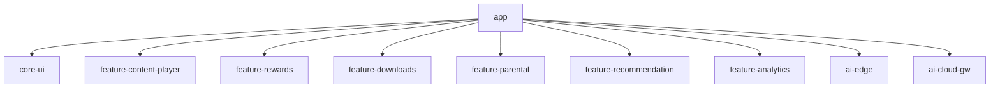
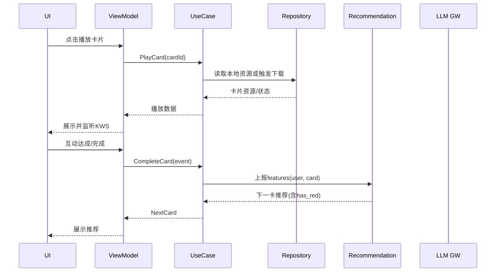

# 架构设计（MVP：3岁男孩-勇敢/逻辑/基础 + 红色偏好 + AI）

文档版本: v1.0  
创建日期: 2025-09-03  
作者: 架构助手  
审核人: 待定

## 1. 目标与原则
- 目标：可维护、可扩展、端侧优先、离线可用、隐私优先，面向MVP快速落地。
- 原则：Clean Architecture + MVVM；KISS/DRY/YAGNI；模块解耦；中文注释强制。

## 2. 架构总览
```
┌─────────────────────────────────────────────────────────────────────┐
│                           Presentation (App)                        │
│  Compose UI ─ ViewModel(StateFlow) ─ Navigator ─ Parental UI        │
└─────────────────────────────────────────────────────────────────────┘
                │                           │
                │                           └─ 家长门/报表/设置
                │
┌─────────────────────────────────────────────────────────────────────┐
│                              Domain                                 │
│  UseCases:                                                          │
│   - PlayCard / CompleteCard / GetNextCard (Bandit)                  │
│   - DownloadTheme / ManageOffline                                   │
│   - GetParentalReport (LLM) / SetTimeLimit / VerifyParentalGate     │
│   - SetColorPreference(red)                                         │
│  Repositories Interfaces                                            │
└─────────────────────────────────────────────────────────────────────┘
                │
┌─────────────────────────────────────────────────────────────────────┐
│                               Data                                  │
│  Local: Room (progress, downloads, prefs), DataStore(K/V)           │
│  Remote: Retrofit(OpenAI网关/后端API)、Downloads、Crash/Analytics   │
│  AI Edge: KWS/Intent(TFLite/ONNX)、MediaPipe Tasks                  │
└─────────────────────────────────────────────────────────────────────┘
                │
┌─────────────────────────────────────────────────────────────────────┐
│                     AI Services & Content Pipeline                  │
│  - LLM: Gemini-2.5-Pro (主) / GPT-5-Pro(备)                         │
│  - Embeddings: Qwen3-Embed；Reranker: BAAI                          │
│  - TTS批处理/响度标准化；内容审核；RAG(可选, 家长引导)              │
└─────────────────────────────────────────────────────────────────────┘
```

## 3. 模块划分


### 3.1 职责说明
- core-ui：主题、颜色令牌（含红色强度档）、组件库、可访问性。
- feature-content-player：卡片播放、互动模板、字幕点读。
- feature-rewards：星星/贴纸、红色粒子动效（弱机降级）。
- feature-downloads：主题包下载、校验回滚、空间提示。
- feature-parental：家长门、时长管理、报表视图。
- feature-recommendation：Bandit策略、上报与缓存；红色权重与曝光上限。
- feature-analytics：埋点、Crash/性能、指标上报。
- ai-edge：Porcupine/Vosk KWS；TFLite/ONNX意图分类；MediaPipe彩蛋。
- ai-cloud-gw：OpenAI协议客户端；RAG装配与安全后处理。

## 4. 数据流与关键用例


## 5. 技术栈与配置（对齐SOP）
- Kotlin, Compose, Material3, Hilt, Navigation, Coroutines/Flow
- 网络：Retrofit + OkHttp；序列化：Moshi/Gson
- 本地：Room、DataStore；下载：WorkManager + 分块/MD5
- 测试：JUnit/MockK/Espresso；质量：ktlint/detekt；崩溃：Crashlytics
- AI端：TFLite/ONNX Runtime Mobile（INT8量化，NNAPI/GPU）；Porcupine/Vosk；MediaPipe
- AI云：OpenAI兼容API；Gemini/GPT-5；Qwen3-Embed；BAAI Reranker；缓存

## 6. 关键设计决策（ADR摘要）
- ADR-001 Clean Architecture + MVVM：提高可测试与解耦。
- ADR-002 端侧优先：KWS与基础意图离线，降低时延与隐私风险。
- ADR-003 OpenAI协议网关：统一多模型接入，容错回退与限流。
- ADR-004 Bandit推荐：轻量个性化，加入prefer_color/has_red特征与曝光上限。
- ADR-005 离线优先：首包≥20卡；下载可断点续传与校验回滚。
- ADR-006 错误语义不使用红色：避免与“红色偏好”冲突，提升可用性。

## 7. 配置与数据模型（节选）
```yaml
# DataStore: user_prefs
prefer_color: "red" | null
color_intensity: low|medium|high
session_limit_minutes: 10|15|20

# Room: tables
- progress(user_id, card_id, completed, duration_ms, ts)
- cards(card_id, theme_id, dominant_color[], objects[], downloaded)
- downloads(theme_id, status, size, checksum)
```

## 8. 安全与合规
- 默认不上传语音/图像；KWS仅本地处理并仅记录命中事件。
- 家长门保护：时长与云侧能力开关；RAG仅家长引导启用。
- 输出安全后处理：长度/词表/禁止外链，敏感主题拦截。

## 9. 性能与降级
- 启动预取必要资源；动效可降级静态；模型INT8量化与算子裁剪。
- 推荐失败→本地rule-based回退；云端超时→备份模型；下载失败→回滚。

## 10. 监控与指标
- 启动耗时、ANR、崩溃率；下载成功率；离线命中率。
- 学习漏斗：打开→首卡→完成→下一卡；红色卡曝光/完成差异；再试一次率。

## 11. 开放问题
- RAG知识库边界与素材来源确权；家长报表模板A/B；弱机最低支持清单。

