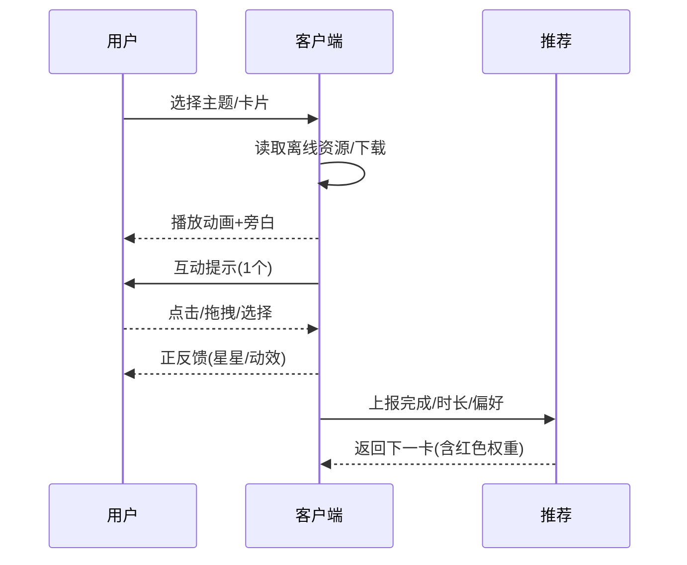

# MVP需求文档（3岁男孩：勇敢·逻辑·基础知识 + 红色偏好）

文档版本: v1.0  
创建日期: 2025-09-03  
作者: 架构助手  
审核人: 待定

## 1. 需求概述

### 1.1 需求背景
- 面向3岁小男孩的启蒙教育App，需要在短时注意力窗口内，围绕“勇敢（社会情绪）+ 逻辑启蒙 + 基础知识”提供沉浸内容与轻交互。
- 用户偏好红色：在不改变学习目标的前提下，进行轻量个性化（UI点缀、内容排序、奖励视觉），保证可访问性与不过度刺激。
- AI最大化用于内容TTS批量合成、端侧KWS、个性化推荐（Bandit）、家长报告摘要、内容安全审核；云侧统一OpenAI协议网关（Gemini-2.5-Pro主，GPT-5-Pro备；Qwen3-Embed；BAAI Reranker）。

### 1.2 目标用户
- 主要用户：3岁小男孩；喜欢车辆/恐龙/鲜艳色彩，尤其偏爱红色；手眼协调尚在发展，倾向一次一项的简单互动。
- 使用场景：居家陪伴、通勤/等候（离线）、睡前短时使用；家长共读引导与孩子独立探索并存。
- 用户价值：提升“敢试”意愿与自我调节；建立早期逻辑概念；掌握基础认知；获得成就感与正向反馈。

### 1.3 业务目标（MoSCoW）
- Must
  - 9主题×6–8卡（60–72卡），每卡20–40秒+1个互动点，完成即奖励。
  - 离线优先：首包自带≥20张卡；其余主题支持下载/删除。
  - 家长门、时长管理、基础进度报表与日报/周报摘要。
  - 红色偏好个性化：UI点缀、内容排序权重、奖励视觉，上限曝光≤60%。
  - 端侧KWS（2–4指令）：“再来一次/暂停/下一张/返回”。
- Should
  - Bandit个性化推荐（含prefer_color=red特征）；结果缓存；纠偏机制。
  - 字幕与名词点读（中/英，可开关）。
- Could
  - 低龄RAG一句话问答（家长引导模式）。
- Won’t（MVP不做）
  - 自由口语ASR长对话；复杂多步骤任务；在线广告与外链。

## 2. 功能详述

### 2.1 功能范围
包含：
- 首页主题网格、主题内卡片列表、卡片播放与轻交互、奖励（星星/贴纸）、下载管理、家长门与时长管理、家长报表、红色偏好配置与呈现、基础推荐与埋点。
不包含：
- 复杂3D游戏化流程；社交分享；在线支付；自由对话。

### 2.2 用户故事（节选）
```
作为 孩子
我想要 打开后3步内开始第一个卡片
以便 快速进入学习并获得成就感
验收：冷启动≤2.5s；3步内播放；完成后获得星星

作为 孩子（喜欢红色）
我想要 看到更多红色主题内容和奖励
以便 更有兴趣完成任务
验收：含红标签卡曝光≤60%；完成率≥非红卡±5%

作为 家长
我想要 设置每日/单次使用时长
以便 控制使用并在到时自动休息
验收：到时弹休息页；需家长门恢复

作为 家长
我想要 查看简短日报/周报与建议
以便 了解进展并进行共读
验收：生成成功率≥99%；2–3句摘要+1条建议
```

### 2.3 功能流程（卡片播放）


### 2.4 交互设计（概述）
- 每卡1个互动点；误触防抖300–500ms；反馈小于300ms。
- 错误提示不使用红色；错误语义使用琥珀/灰并配合柔和文案。

## 3. 业务规则

### 3.1 数据规则（节选）
| 字段名 | 类型 | 必填 | 规则说明 |
|-------|------|------|---------|
| user_id | String | 是 | 匿名UUID，本地生成 |
| prefer_color | String | 否 | 默认null；可为"red" |
| card_id | String | 是 | 唯一标识 |
| dominant_color | String[] | 否 | 如["red","yellow"] |
| completion | Boolean | 是 | 卡片是否完成 |
| duration_ms | Int | 是 | 本次学习时长 |

### 3.2 业务逻辑（要点）
1. 红色曝光上限60%，探索比例≥20%，防止过拟合。
2. 到时休息页不可跳过；需家长门恢复。
3. 无网络时仅显示已下载主题；下载失败自动重试3次+断点续传。

### 3.3 异常处理（节选）
| 异常 | 处理 | 文案 |
|-----|-----|-----|
| 网络异常 | 显示缓存/离线内容 | “网络不太给力，离线内容继续看” |
| 存储不足 | 提示清理下载包 | “空间不足，请删除部分主题后再试” |
| 下载校验失败 | 回滚并重下 | “资源校验失败，已为你自动修复” |

## 4. 非功能需求
- 性能：冷启动≤2.5s；帧率≥55fps（中端机）；内存峰值≤350MB。
- 安全：最小化采集；不上传语音/图像；家长门保护敏感设置。
- 兼容：Android 7.0+；竖屏；弱网与离线可用。

## 5. 验收标准
- 功能：用户故事验收点全部通过；下载、离线、奖励闭环跑通。
- 性能：启动、帧率、内存、包体指标达标。
- 质量：通过测试用例；代码审查无P0/P1缺陷；崩溃率≤0.5%。

## 6. 依赖说明（纯客户端架构）
- **架构说明**：本应用采用纯客户端架构，无自建服务端，所有功能在Android App内实现。
- **端侧AI**：TFLite/ONNX Runtime Mobile（关键词唤醒）、MediaPipe Tasks（可选）、Porcupine/Vosk（KWS）。
- **第三方API**：
  - OpenAI兼容网关（LLM文本生成）：Gemini-2.5-Pro（主）/GPT-5-Pro（备）
  - 嵌入向量服务：Qwen3-Embed
  - 重排序服务：BAAI Reranker（可选）
  - CDN/OSS：内容包下载存储
- **本地存储**：Room Database（结构化数据）、DataStore（配置）、File System（媒体资源）。
- **AI服务配置**：支持可定制 `apiBaseUrl` + `apiKey`（详见 docs/ai-config.md），以适配国内网络环境与多供应商切换。

## 7. 工作量评估（粗估）
| 任务 | 负责人 | 工时 | 备注 |
|-----|------|-----|-----|
| UI/首页/主题列表 | 前端 | 6人天 | Compose |
| 播放器+互动模板 | 前端 | 10人天 | 点击/拖拽/单选 |
| 奖励与贴纸 | 前端 | 5人天 | 含持久化 |
| 下载模块 | 前端 | 8人天 | 断点/校验 |
| 家长门与时长 | 前端 | 6人天 | DataStore |
| 报表+摘要 | 前后 | 6人天 | 云侧LLM |
| 推荐（Bandit） | 后端 | 6人天 | 在线学习 |
| TTS与审核流水线 | 内容 | 8人天 | 批处理脚本 |
| 测试与验收 | QA | 8人天 | 自动化部分 |
| 总计 | - | 63人天 | - |

## 8. 风险评估
| 风险 | 可能性 | 影响 | 应对 |
|-----|------|-----|-----|
| 低端机性能 | 中 | 高 | 模型量化/动效降级 |
| 内容产能 | 中 | 中 | 模板化+批处理+优先级 |
| 合规审查 | 低 | 高 | 家长门+脱敏+法务审阅 |

## 9. 发布计划（MVP 4周）
- W1 方向冻结；W2 骨架成型；W3 闭环可跑；W4 打磨与内测。
- 灰度：5%→20%→50%→100%；可快速回滚。

## 10. 附录
- 竞品：斑马百科等；
- 术语：KWS=关键词唤醒；Bandit=多臂老虎机；RAG=检索增强生成；
- 修订记录：v1.0 首版。
