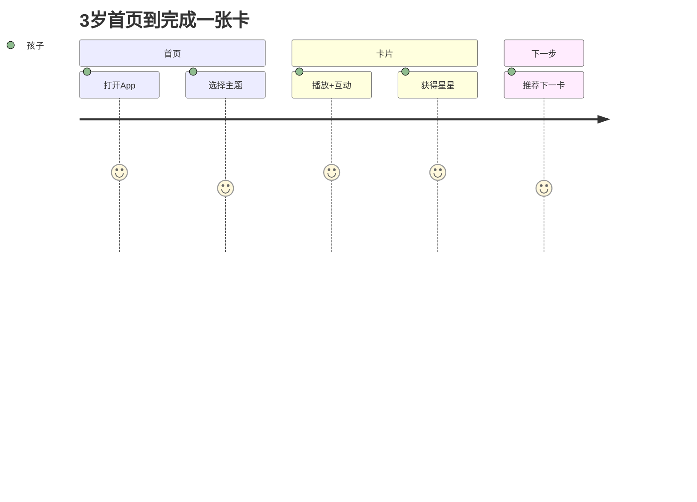

# UX/UI设计（MVP：3岁男孩-勇敢/逻辑/基础 + 红色偏好）

文档版本: v1.0  
创建日期: 2025-09-03  
作者: 架构助手  
审核人: 待定

## 1. 用户研究摘要
- 用户：3岁男孩，偏爱红色；注意力6–8分钟/次；喜欢车辆/恐龙；误触概率高。
- 家长：关注价值、安全、时长控制与进度可见；希望简短建议文本。

## 2. 信息架构与导航
```
首页(主题网格) → 主题内页(卡片列表) → 卡片播放(互动与奖励) → 下一卡推荐
                                  ↘ 家长门 → 家长中心(时长/下载/报表)
```
- 导航：底部仅一层入口（首页/家长门），减少分心。
- 竖屏锁定；返回手势启用；家长入口需长按3秒+算术题。

## 3. 设计系统（红色偏好）
### 3.1 颜色令牌
- 主色(primary)：珊瑚红（非警示红）；三档强度：low/medium/high
- 语义色：错误=琥珀/灰；禁止使用红色表达错误语义
- 可访问性：关键文本对比≥4.5:1；红/绿不作唯一区分

### 3.2 组件规范（节选）
- 大按钮：高度≥64dp；圆角32dp；按下阴影从8dp→4dp；触觉反馈轻震
- 卡片：点击区域≥48dp；误触防抖300–500ms；完成有星星动效≤800ms
- 贴纸册：拖拽阈值8dp；弱机降级为点击放置

## 4. 关键界面与交互
### 4.1 首页-主题网格
- 模块：主题卡（封面、进度条、下载状态、离线标识）
- 排序：含红标签主题在顶部2–3位内（若prefer_color=red）
- 空间：3列网格；最少触发范围≥64dp

### 4.2 主题内页-卡片列表
- 状态：已看/未看、下载/未下载
- 下载：支持批量下载/删除；弱网提示

### 4.3 播放器-互动卡
- 播放：20–40秒动画+童声旁白；字幕可开关；名词可点读
- 互动：仅1个点（点击/拖拽/单选）；错误不给红色，仅提示并鼓励
- KWS：再来一次/暂停/下一张/返回（命中有红色粒子，≤800ms）

### 4.4 奖励-星星与贴纸
- 完成即发放星星；主题完成解锁“红色徽章”
- 贴纸墙可拖拽摆放；持久化位置

### 4.5 家长中心
- 时长设置（每日/单次）；下载管理；简短日报/周报+建议；色彩偏好强度开关

## 5. 可用性与无障碍
- 字体：标题≥32sp，正文≥18sp；行距≥1.3；触点≥48dp
- 音频：响度标准化；环境噪声高时提示关闭KWS
- 视觉：色弱友好；以形状/图标作为辅助区别

## 6. 原型与流程（Mermaid）


## 7. 文案与语气
- 面向孩子：短句、积极、具体；不含命令语气
- 面向家长：2–3句摘要+1条建议；避免专业术语和营销

## 8. 资产规范
- 动效：Lottie/WebP；红色粒子动效≤800ms；提供低配静态替代
- 字体：无衬线；数字等宽可选
- 图标：线面结合，避免尖锐

## 9. 验收要点（UX）
- 3步内进入首卡；互动命中率≥98%；完成即奖励
- 红色偏好生效且可在家长中心调节；错误语义无需红色
- 弱网/离线场景下核心路径可达

